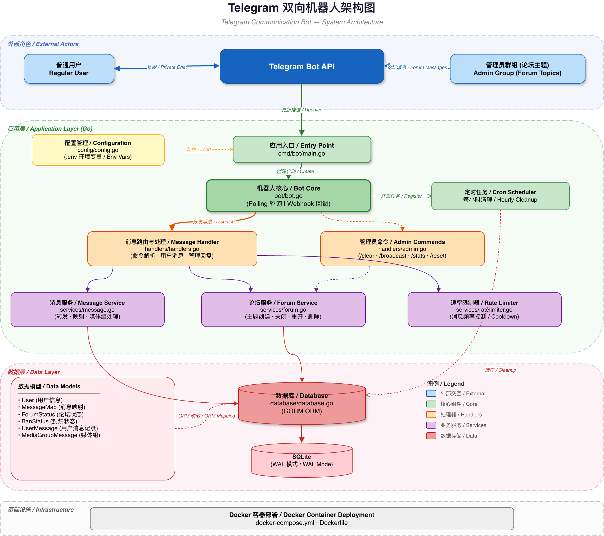

<div align="center">

# Telegram 双向机器人

**轻量、高效、开箱即用的 Telegram 双向消息转发机器人**

用户私聊消息自动转发至管理群组，管理员直接在论坛话题中回复——零门槛实现双向沟通。

[](https://go.dev/)
[](LICENSE)
[](docker-compose.yml)

[English](README.en.md) | **中文**

</div>

---

## 特性

- **双向消息转发** — 用户私聊 Bot 的消息自动转发到管理群组，管理员回复自动推送给用户
- **论坛话题隔离** — 每个用户独享一个 Forum Topic，对话上下文清晰不混乱
- **富媒体支持** — 文字、图片、视频、文件、语音、贴纸、位置、联系人、媒体组全类型覆盖
- **人机验证** — 新用户首次对话需完成数学 CAPTCHA 验证，有效拦截机器人刷消息
- **频率限制** — 可配置的消息发送间隔，防止滥用刷屏
- **管理员工具** — 广播消息 / 用户统计 / 对话清理 / 话题重置，一套命令搞定
- **封禁机制** — 支持永久封禁，可配置删除话题即封禁
- **自动容错** — 话题被误删后，用户下次发消息自动创建新话题
- **双模式运行** — 支持 Polling 轮询和 Webhook 回调，适配不同部署场景
- **轻量部署** — 单二进制 + SQLite，Docker 一键启动，无外部依赖

## 架构

<div align="center">

</div>

## 快速开始

### 前置准备

| 步骤 | 操作 | 说明 |
|------|------|------|
| 1 | 联系 [@BotFather](https://t.me/botfather) 创建 Bot | 获取 `BOT_TOKEN` |
| 2 | 创建 Supergroup 并开启论坛功能 | 将 Bot 添加为管理员 |
| 3 | 获取群组 ID（负数） | 通过 [@userinfobot](https://t.me/userinfobot) 获取 |
| 4 | 获取管理员用户 ID | 同上 |

### Docker Compose 部署（推荐）

```bash
git clone https://github.com/PiPiLuLuDoggy/telegram-communication-bot.git
cd telegram-communication-bot

cp .env.example .env
```

编辑 `.env`，填入必要配置：

```bash
BOT_TOKEN=your_bot_token
ADMIN_GROUP_ID=-1001234567890
ADMIN_USER_IDS=123456789
```

启动：

```bash
docker compose up -d
```

### 本地编译运行

```bash
# 编译
make build

# 运行
make run
```

> 默认使用 Polling 模式。如需 Webhook，请设置 `WEBHOOK_URL` 环境变量。

## 使用方式

### 用户端

1. 在 Telegram 中搜索你的 Bot 并发送 `/start`
2. 若启用了人机验证，需先完成数学验证题（点击正确答案按钮）
3. 验证通过后即可发送任意消息，Bot 会自动转发给管理员
4. 管理员的回复会通过 Bot 推送给你

### 管理端

1. 在管理群组中查看用户消息——每个用户对应一个论坛话题
2. 新话题会自动展示用户信息（用户名、ID）
3. 直接在对应话题中回复即可，消息自动转发给用户

## 管理员命令

| 命令 | 说明 | 用法 |
|------|------|------|
| `/start` | 检查 Bot 运行状态 | `/start` |
| `/stats` | 查看用户 / 对话统计 | `/stats` |
| `/broadcast` | 向所有用户广播消息 | 回复一条消息后发送 `/broadcast` |
| `/clear <id>` | 清理用户对话 | `/clear 123456789` |
| `/reset <id>` | 重置用户话题（修复话题删除问题） | `/reset 123456789` |

## 配置参考

| 变量 | 说明 | 默认值 | 必填 |
|------|------|--------|:----:|
| `BOT_TOKEN` | Telegram Bot Token | — | ✅ |
| `ADMIN_GROUP_ID` | 管理群组 ID（负数） | — | ✅ |
| `ADMIN_USER_IDS` | 管理员用户 ID，逗号分隔 | — | ✅ |
| `APP_NAME` | 应用名称 | `TelegramCommunicationBot` | |
| `WELCOME_MESSAGE` | 用户首次 `/start` 时的欢迎语 | 默认中文欢迎词 | |
| `CAPTCHA_ENABLED` | 启用新用户人机验证 | `false` | |
| `MESSAGE_INTERVAL` | 用户消息发送最小间隔（秒） | `5` | |
| `DELETE_TOPIC_AS_FOREVER_BAN` | 删除话题时永久封禁用户 | `false` | |
| `DELETE_USER_MESSAGE_ON_CLEAR_CMD` | `/clear` 时同时删除消息 | `false` | |
| `DATABASE_PATH` | SQLite 数据库路径 | `./data/bot.db` | |
| `PORT` | Webhook 监听端口 | `8090` | |
| `WEBHOOK_URL` | Webhook 地址（留空使用 Polling） | — | |
| `DEBUG` | 调试模式 | `false` | |

## 项目结构

```
telegram-communication-bot/
├── cmd/bot/main.go           # 入口
├── internal/
│   ├── bot/bot.go            # Bot 核心（Polling / Webhook）
│   ├── config/config.go      # 配置加载与校验
│   ├── handlers/
│   │   ├── handlers.go       # 消息路由与分发
│   │   └── admin.go          # 管理员命令处理
│   ├── services/
│   │   ├── message.go        # 消息转发 / 映射 / 媒体组
│   │   ├── forum.go          # 论坛话题管理
│   │   ├── captcha.go        # 人机验证（CAPTCHA）
│   │   └── ratelimiter.go    # 速率限制
│   ├── database/database.go  # 数据库操作（GORM + SQLite）
│   └── models/models.go      # 数据模型定义
├── docker-compose.yml
├── Dockerfile
├── Makefile
└── .env.example
```

## 常见问题

<details>
<summary><b>Bot 无响应？</b></summary>

检查 `BOT_TOKEN` 是否正确，查看容器日志：

```bash
docker compose logs -f telegram-bot
```
</details>

<details>
<summary><b>无法创建论坛话题？</b></summary>

确认以下三点：
1. 群组已开启「论坛」功能（群组设置 → Topics）
2. Bot 在群组中拥有管理员权限
3. `ADMIN_GROUP_ID` 为负数且正确
</details>

<details>
<summary><b>误删了用户话题怎么办？</b></summary>

用户下次发消息时会自动创建新话题。也可手动执行：

```
/reset <用户ID>
```
</details>

<details>
<summary><b>如何备份数据？</b></summary>

```bash
docker cp telegram-communication-bot:/app/data/bot.db ./backup.db
```
</details>

<details>
<summary><b>如何更新到最新版本？</b></summary>

```bash
docker compose down
git pull
docker compose up -d --build
```
</details>

## License

本项目基于 [Apache License 2.0](LICENSE) 开源。
